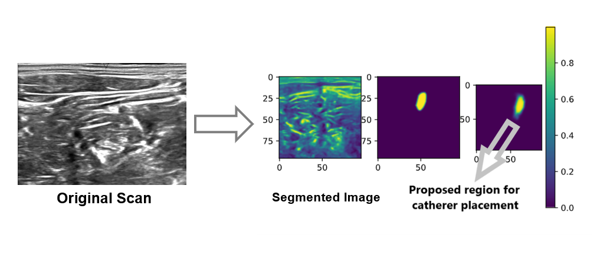
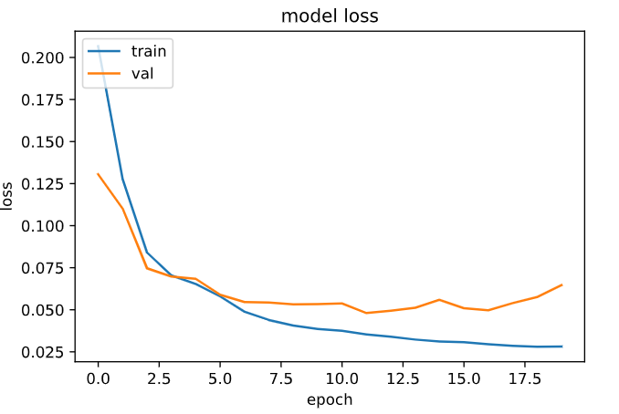

# Catheter Positioning tool

The following project leverages the applications of Semantic Segmentation in accuractely identifying the nerve strucure in Ultrasound Images and thereby proving a region of interest for the safe administration of the catheter.

## Project Execution

- Clone the project from `https://github.com/pranay-ar/Catheter-Positioning-Tool.git'`
- Create a `virtualenv` by executing the following command: `virtualenv -p python3 env`.
- Activate the `env` virtual environment by executing the follwing command: `source env/bin/activate`.
- Enter the cloned repository directory and execute `pip install -r requirements.txt`.
- Download the data from the [source](https://www.kaggle.com/c/ultrasound-nerve-segmentation/data) and arrange the training and test data into `train` and `test` folders in the same directory.
- All the utility functions required in training and preprocessing the images can be found in `utils.py`.
- Hover over to the `model.ipynb` to understand the flow of training the U-Net Model. 
- After training the model, you can visualise the results by running the `test.ipynb`.

## Performance Analysis

- ### Task at hand: 

- ### Training Loss:

- ### F1 Score:

## References

- U-Net Architecture: [U-Net](https://arxiv.org/abs/1505.04597)
- Canny Edge Detection: [Canny Edge](https://docs.opencv.org/master/da/d22/tutorial_py_canny.html)
- Dataset: [Kaggle](https://www.kaggle.com/c/ultrasound-nerve-segmentation/data)

## Authors

- [Pranay Reddy](https://github.com/pranay-ar)
- [Vipul Goel](https://github.com/deto-5420)